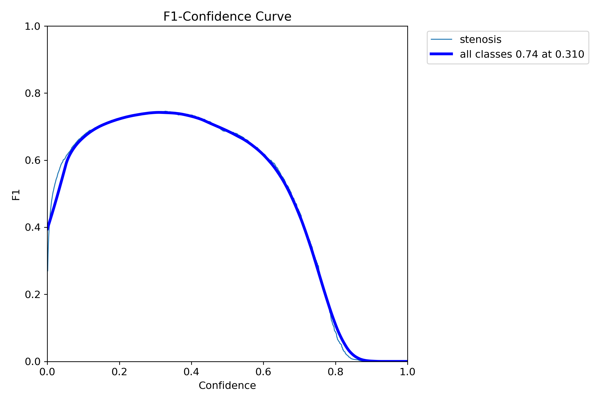
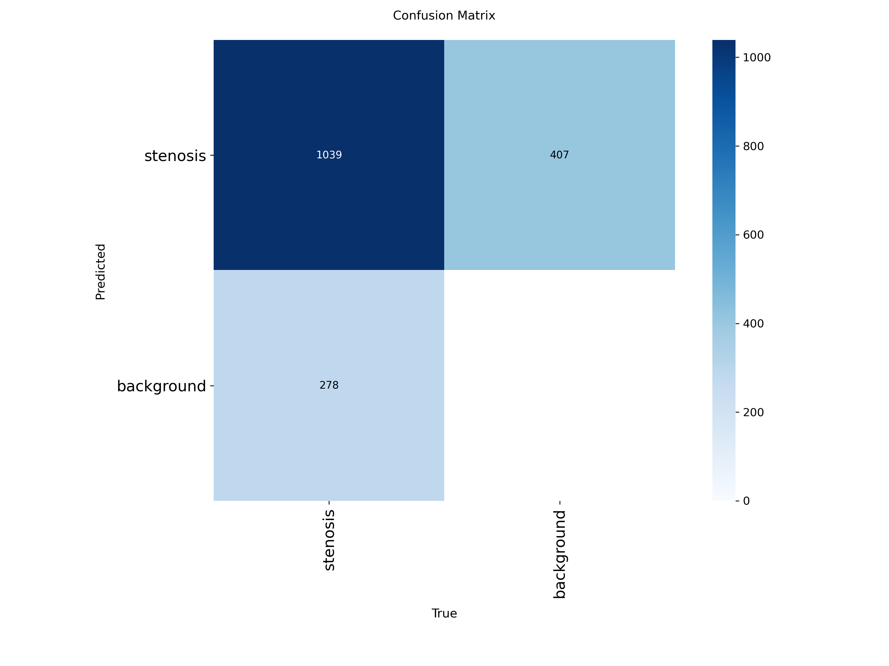
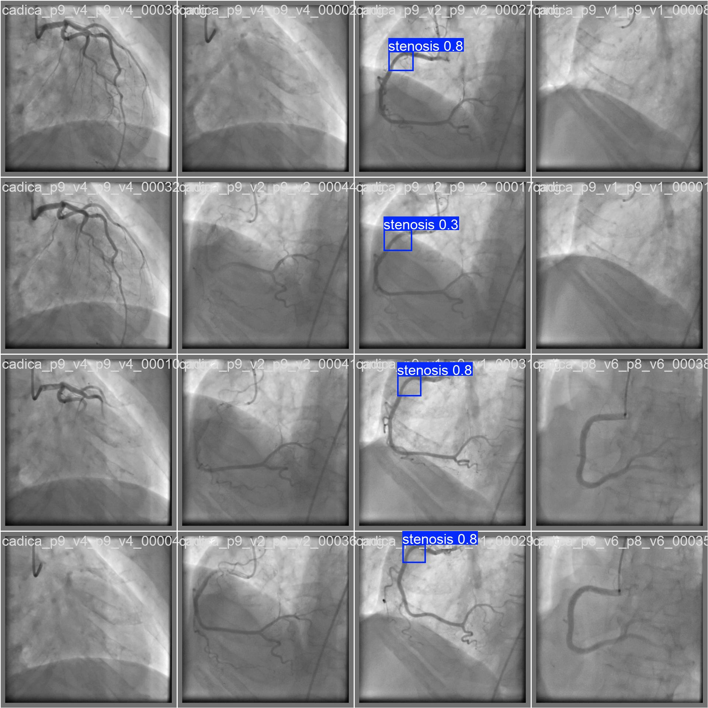
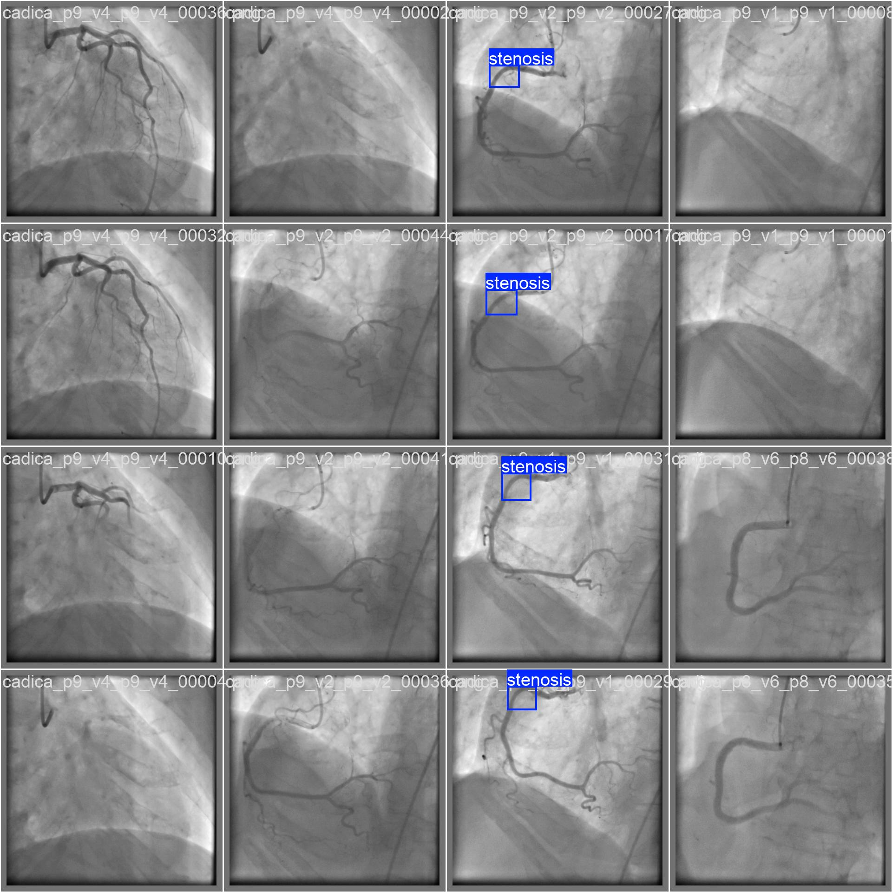

# Coronary Artery Stenosis Detection — YOLOv8-M

Real-time detection of coronary artery stenosis in angiographic images using YOLOv8-M fine-tuned on combined ARCADE + CADICA datasets.

## Problem

Coronary artery stenosis (narrowing of coronary arteries) is a leading cause of cardiovascular disease worldwide. Manual analysis of coronary angiograms during catheterization is time-consuming and operator-dependent. This project provides an automated bounding-box detection system for stenotic lesions to assist clinicians in real-time during interventional procedures.

## Base Model — YOLOv8-M (Medium)

The model is built on **YOLOv8-M** from [Ultralytics](https://github.com/ultralytics/ultralytics):

| Property | Value |
|---|---|
| Architecture | YOLOv8-M (Medium) |
| Parameters | 25.9M |
| Weight size | 50 MB (.pt) / 112 MB (.onnx) |
| Pretrained on | **COCO 2017** — 330k images, 80 object classes |
| Fine-tuned for | Coronary stenosis detection (1 class) |

**Transfer learning**: The base model was pretrained on [COCO 2017](https://cocodataset.org/) (Common Objects in Context) — a large-scale dataset of 330,000 images with 80 everyday object classes (people, vehicles, animals, etc.). These pretrained weights provide the model with general visual feature extraction capabilities (edges, shapes, textures). During fine-tuning on our angiographic data, the model adapts these features to detect stenotic lesions in coronary arteries.

### What the model outputs

For each detected stenosis, the model returns:
- **Bounding box** — `(x1, y1, x2, y2)` coordinates of the detection rectangle
- **Confidence** — detection certainty (0.0–1.0)
- **Class** — object class (`0 = stenosis`)

## Dataset

The dataset combines two public coronary angiography datasets:

| Property | ARCADE | CADICA | Combined |
|---|---|---|---|
| Images | ~5,500 | ~14,500 | 19,654 |
| With stenosis | 100% | 22% | 28% |
| Avg bbox area | ~4% of image | ~0.8% of image | — |
| Image size | 512×512 | 512×512 | 512×512 |

- **[ARCADE](https://zenodo.org/records/10390295)** — Automatic Region-based Coronary Artery Disease diagnostics using x-ray angiography images. All images contain stenosis annotations with relatively large bounding boxes.
- **[CADICA](https://cadica.grand-challenge.org/)** — Coronary Artery Disease detection in Angiography. Primarily normal images (~78%), with stenosis annotations having very small bounding boxes (~93.5% under 2% image area).

**Dataset split** (stratified, preserving stenosis ratio ~28% in each):
| Split | Images | Purpose |
|---|---|---|
| Train | 15,722 | Model training |
| Validation | 1,964 | Hyperparameter tuning, early stopping |
| Test | 1,968 | Final evaluation (never seen during training) |

**Label format**: YOLO (`class x_center y_center width height`, normalized 0–1)

### Dataset challenge — why combining two datasets is problematic

This project's main challenge is that ARCADE and CADICA were created by **different research groups with fundamentally different annotation philosophies**, and the model must learn a single definition of "stenosis" from conflicting ground truth:

| Aspect | ARCADE | CADICA |
|---|---|---|
| **Annotation style** | Large bounding boxes covering the lesion area and surrounding vessel context | Extremely tight, small bounding boxes tightly cropped to the stenosis point |
| **Avg bbox area** | ~4% of image | ~0.8% of image (5x smaller) |
| **Positive rate** | 100% of images have stenosis | Only 22% have stenosis |
| **Bbox size distribution** | Mostly medium-large | 93.5% are tiny (<2% image area) |

**Why this matters**: When the model sees a stenosis during training, ARCADE teaches it to predict a large box, while CADICA teaches it to predict a tiny box — for the same type of lesion. The model learns a compromised middle ground that satisfies neither dataset perfectly. This directly hurts IoU-based metrics like mAP, because:
- On ARCADE images: the model predicts boxes that are too small → lower IoU overlap
- On CADICA images: the model predicts boxes that are too large → lower IoU overlap

This annotation style mismatch — not model capacity — is the primary reason our metrics (mAP@0.5 = 0.784) are below literature benchmarks that train and evaluate on a single dataset with consistent annotations. Training on either dataset alone, or harmonizing the annotation styles before merging, would likely yield significantly higher metrics.

## Training Configuration

| Parameter | Value |
|---|---|
| Base weights | `yolov8m.pt` (COCO pretrained) |
| Image size | 512×512 |
| Batch size | 64 |
| Optimizer | AdamW |
| Initial LR | 0.001 |
| Final LR factor | 0.01 |
| Max epochs | 300 |
| Early stopping patience | 50 |
| Actual epochs trained | 231 (early stop at 181 best) |
| Training time | ~5 hours |
| GPU | NVIDIA RTX 4090 (24 GB) |

**Augmentations**: HSV jitter (h=0.015, s=0.4, v=0.3), rotation (±15°), translation (0.1), scale (0.5), vertical/horizontal flip (0.5), mosaic (1.0), mixup (0.1).

## Results

### Test Set Evaluation (1,968 images)

| Metric | Value |
|---|---|
| **mAP@0.5** | **0.784** |
| **mAP@0.5:0.95** | **0.416** |
| Precision | 0.740 |
| Recall | 0.762 |
| **F1-score** | **0.750** |

### With Test-Time Augmentation (TTA)

| Metric | Standard | + TTA |
|---|---|---|
| mAP@0.5 | 0.784 | **0.795** (+1.4%) |

### Comparison with Literature

| Model | mAP@0.5 | F1 | Source |
|---|---|---|---|
| RFCN ResNet-101 V2 | 0.94 | 0.96 | Danilov 2021 |
| DCA-YOLOv8 | 0.976 | 0.958 | Duan 2024 |
| **YOLOv8-M (ours)** | **0.784** | **0.750** | This project |

> **Note**: Literature models are trained and evaluated on single datasets with consistent annotation styles. Our lower scores are a direct consequence of the annotation mismatch between ARCADE and CADICA (see [Dataset challenge](#dataset-challenge--why-combining-two-datasets-is-problematic) above). The model itself has sufficient capacity — the bottleneck is the conflicting ground truth, not the architecture.

### Training Curves

Training loss and validation metrics over 231 epochs:


### Evaluation Plots

| PR Curve | F1 Curve | Confusion Matrix |
|---|---|---|
|  |  |  |

### Detection Examples

Predictions (left) vs ground truth (right) on validation images:

| Predictions | Ground Truth |
|---|---|
|  |  |
|  |  |

## Quick Start

### Installation

```bash
pip install -r requirements.txt
```

### Inference

```bash
# CLI
yolo predict model=weights/best.pt source=your_image.png conf=0.25

# Python
from ultralytics import YOLO

model = YOLO("weights/best.pt")
results = model.predict("your_image.png", conf=0.25)

for r in results:
    for box in r.boxes:
        x1, y1, x2, y2 = box.xyxy[0].tolist()
        confidence = box.conf[0].item()
        print(f"Stenosis at ({x1:.0f},{y1:.0f})-({x2:.0f},{y2:.0f}), conf={confidence:.2f}")
```

### ONNX Inference

```python
from ultralytics import YOLO

model = YOLO("weights/best.onnx")
results = model.predict("your_image.png")
```

## Reproduce Training

```bash
# 1. Verify dataset format
python scripts/verify_dataset.py --images dataset/images --labels dataset/labels

# 2. Prepare stratified train/val/test split
python scripts/prepare_split.py --images path/to/images --labels path/to/labels --output dataset

# 3. Train on GPU
python train.py --batch 64 --imgsz 512 --device 0

# 4. Evaluate on test set
python evaluate.py --weights weights/best.pt

# 5. Benchmark inference speed
python scripts/benchmark_speed.py --weights weights/best.pt

# 6. Export to ONNX
yolo export model=weights/best.pt format=onnx imgsz=512 simplify=True
```

## Project Structure

```
coronary-stenosis-yolov8/
├── README.md
├── requirements.txt
├── data.yaml                    # Dataset configuration
├── train.py                     # Training script (YOLOv8-M)
├── evaluate.py                  # Test set evaluation
├── scripts/
│   ├── verify_dataset.py        # Dataset format validation
│   ├── prepare_split.py         # Stratified train/val/test split
│   ├── visualize_results.py     # Prediction visualization
│   └── benchmark_speed.py       # Inference speed benchmark
├── weights/
│   ├── best.pt                  # Trained weights (50 MB)
│   └── best.onnx                # ONNX export (112 MB)
└── results/
    ├── metrics.json             # Test set metrics
    ├── results.csv              # Per-epoch training metrics
    ├── results.png              # Loss/mAP training curves
    ├── PR_curve.png             # Precision-Recall curve
    ├── F1_curve.png             # F1-Confidence curve
    ├── confusion_matrix.png     # Confusion matrix
    └── examples/                # Detection visualizations
```

## License

MIT
